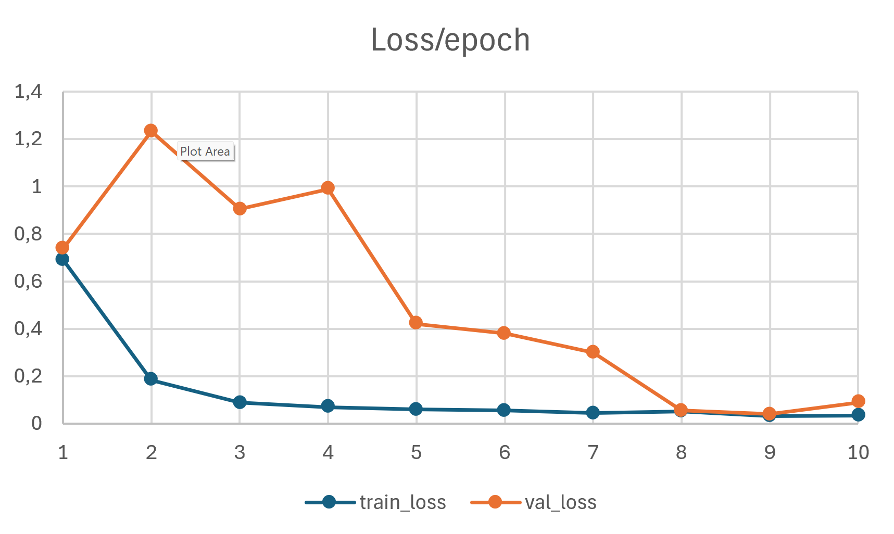
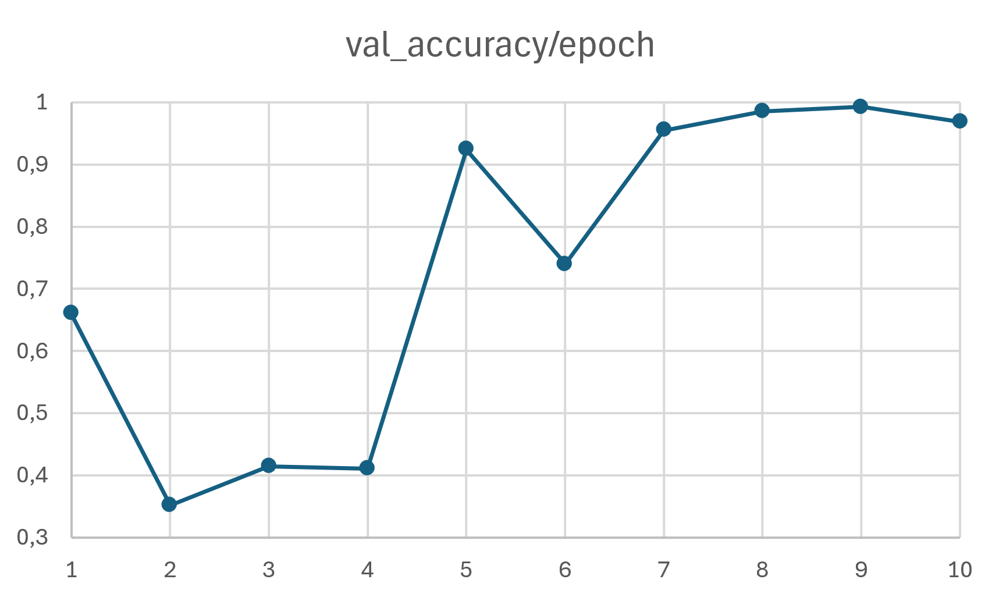
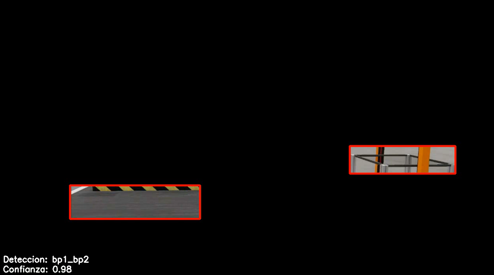
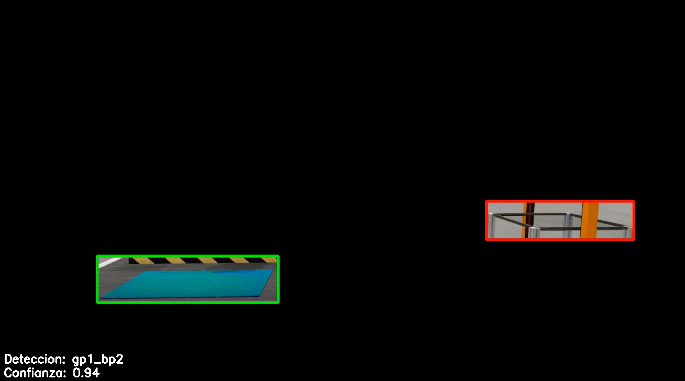
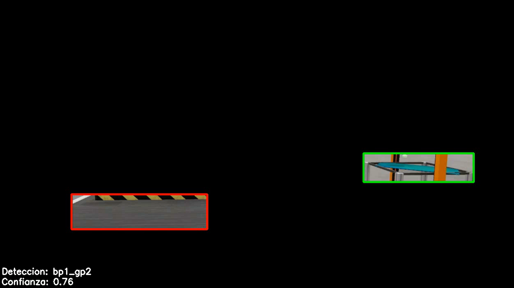
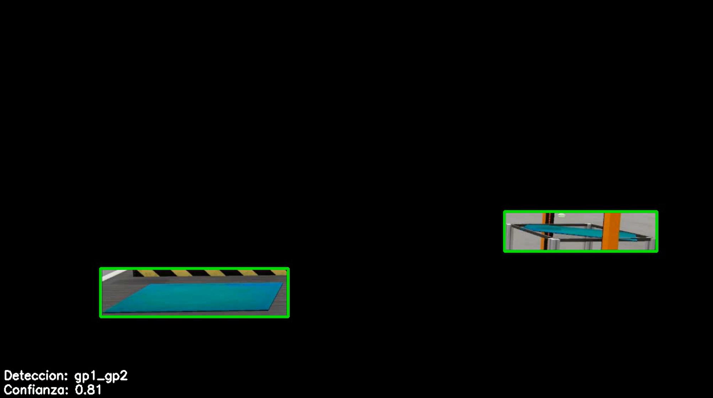

# GBP_Simu - Détection sur une simulation du bon ou mauvais positionnement de cartes sur la ligne de production principale

### Utilisation
### Si vous voulez entraîner votre propre modèle avec les données
1. Clonez le dépôt  
2. Décompressez data.zip et chargez-le dans la racine du projet (où il se trouve déjà). Cela divise les 4 situations/positions que le modèle peut détecter.  
3. Téléchargez toutes les versions de ce Git ([Simu_Video](https://github.com/IsmaTIBU/GBP_Simu/releases/tag/Simu_Video)) et chargez-les dans la racine du projet, comme nous l'avons fait avec le dossier 'data'  
4. Exécutez 'video_mask.py' pour générer une vidéo de la ligne de production en lui appliquant un masque pour que le modèle puisse se concentrer sur les 2 positions principales et moins de données soient nécessaires pour l'entraîner, cela prendra du temps. Le résultat sera chargé dans Output/output_masked_video.mp4.  
5. Exécutez 'Training.py'. Il entraînera le modèle, idéalement vous devriez trouver que val_loss et loss finissent sur une valeur plutôt similaire et accuracy et val_accuracy auraient une note plutôt élevée (de 0-1).  
<table>
<tr>
<td></td>
<td></td>
</tr>
<tr>
<td colspan="2" align="center"><em>Perte d'entraînement et de validation / époques | Précision de validation / époques</em></td>
</tr>
</table>
6. Exécutez 'Model_test.py'. Ici nous étiquettons la vidéo masquée avec des carrés qui changent de couleur selon la position de la carte, en d'autres termes, selon ce que le modèle détecte.  
<table>
<tr>
<td></td>
<td></td>
</tr>
<tr>
<td></td>
<td></td>
</tr>
<tr>
<td colspan="4" align="center"><em>Détection du modèle pour les différentes configurations et sa précision 'Confiance'</em></td>
</tr>
</table>

#### Si vous souhaitez utiliser ce projet pour une simulation personnelle, vous devriez enregistrer une vidéo, l'utiliser dans 'videoToPhoto.py' comme entrée, ce qui divisera la vidéo en toutes ses images et les sauvegardera dans 'data', puis mettre les différentes positions dans leur dossier respectif. Vous devrez également changer les configurations de masques dans 'video_mask.py' et l'étiquetage dans 'Model_test.py'.   

### Si vous souhaitez seulement visualiser les résultats avec le modèle entraîné actuel  
1. Clonez le dépôt
2. Décompressez data.zip et chargez-le dans la racine du projet (où il se trouve déjà). Cela divise les 4 situations/positions que le modèle peut détecter.
3. Téléchargez toutes les versions de ce Git ([Simu_Video](https://github.com/IsmaTIBU/GBP_Simu/releases/tag/Simu_Video) & [PositionDetection_Model](https://github.com/IsmaTIBU/GBP_Simu/releases/tag/PosiotionDetection_Model)) et chargez-les dans la racine du projet, comme nous l'avons fait avec le dossier 'data'  
4. Exécutez 'video_mask.py' pour générer une vidéo de la ligne de production en lui appliquant un masque pour que le modèle puisse se concentrer sur les 2 positions principales et moins de données soient nécessaires pour l'entraîner, cela prendra du temps. Le résultat sera chargé dans Output/output_masked_video.mp4.  
5. Exécutez 'Model_test.py'. Ici nous étiquettons la vidéo masquée avec des carrés qui changent de couleur selon la position de la carte, en d'autres termes, selon ce que le modèle détecte.
6. <table>
<tr>
<td></td>
<td></td>
</tr>
<tr>
<td></td>
<td></td>
</tr>
<tr>
<td colspan="4" align="center"><em>Détection du modèle pour les différentes configurations et sa précision 'Confiance'</em></td>
</tr>
</table>
